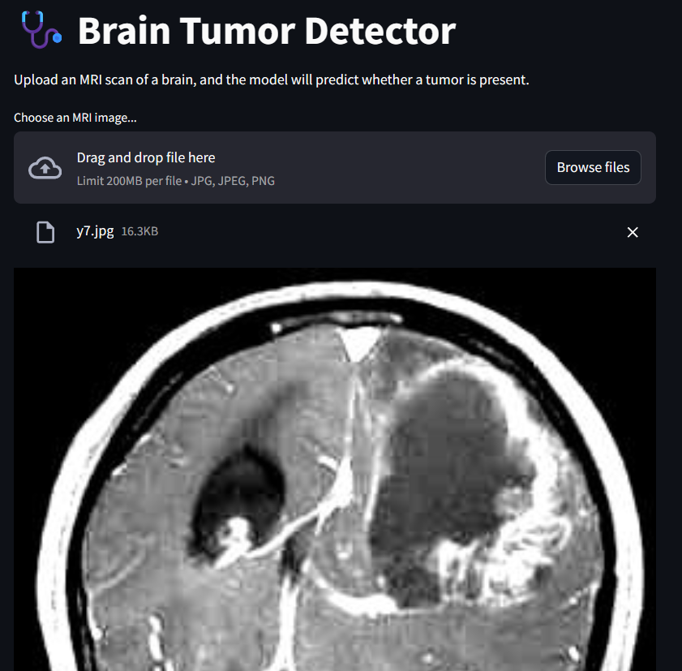
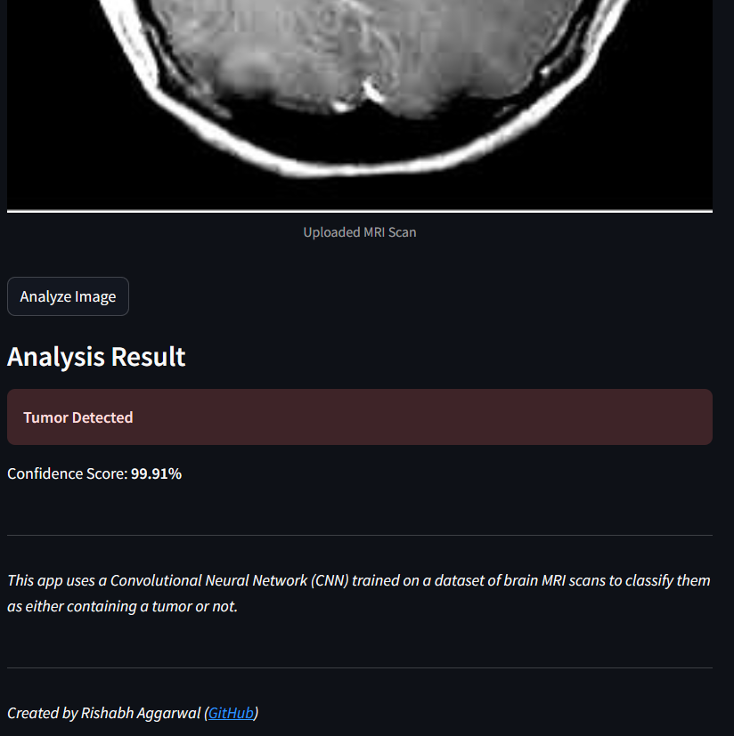

# 🩺 Brain Tumor Detector with Streamlit

This project provides a simple, user-friendly web application for detecting brain tumors in MRI images.  
It uses a **custom-trained Keras model** (`model1.h5`) and a **Streamlit** frontend for making real-time predictions.

---

## 🎯 Objective

- Detect brain tumors from MRI scans using a **Keras CNN model**.  
- Provide a **fast, accurate, and user-friendly** analysis tool for research or educational use.

---

## ✨ Features

- 📤 Upload MRI scans directly in the Streamlit web app.  
- 🧠 CNN-based deep learning model for tumor classification.  
- 🧩 Automatic preprocessing (RGB conversion, resizing, normalization).  
- 📊 Confidence score display for predictions.  
- ⚠️ Graceful error handling if model file is missing.  
- 🧑‍💻 Fully open-source and customizable.

---

## 🖼️ Demo

### 1. Upload Screen

This is the screen where users can upload their MRI scans.

 
*: Upload an MRI scan to begin processing.*

---
### 2. Prediction Screen

Once the MRI scan is uploaded, the model predicts if a tumor is present, along with a confidence score.

  
*: The model's prediction displayed with confidence.*


---

## 🚀 Getting Started

Follow these steps to run the app locally:

### 1. Prerequisites

Make sure you have **Python 3.7+** installed.

### 2. Project Setup

   Set up a new folder for this project and place the following files inside it:

   - `app.py` — The Streamlit application script  
   - `requirements.txt` — The list of necessary packages  
   - `model1.h5` — Your trained Keras model file  
   - `README.md` — This file

   Your folder structure should look like this:

   ```
   /brain-tumor-app
   |-- app.py
   |-- requirements.txt
   |-- model1.h5
   |-- README.md
   ```


### 3. Create and Activate a Virtual Environment

```bash
python -m venv venv

# Activate (Windows)
venv\Scripts\activate

# Activate (macOS/Linux)
source venv/bin/activate
```

### 4. Install Dependencies

Install all required packages:

```bash
pip install -r requirements.txt
```

Or use this quick install list:

```bash
pip install streamlit tensorflow pillow numpy
```

### 5. Run the Application

```bash
streamlit run app.py
```

Then open your browser and go to **http://localhost:8501**.

---

## 📘 How It Works

1. Upload an MRI image (JPG/PNG).  
2. The CNN model (`model1.h5`) processes and predicts the result.  
3. The app displays whether a tumor is detected along with confidence.

---

## 🧩 Dataset

Model trained on the **BRATS 2019** dataset:  
🔗 [Kaggle - BRATS 2019 MRI Dataset](https://www.kaggle.com/datasets/aryanfelix/brats-2019-traintestvalid)

> Note: You need a Kaggle account to download the dataset.

---

## ⚠️ Disclaimer

> This project is intended **for research and educational purposes only**.  
> It is **not** a substitute for professional medical diagnosis or advice.

---

## 🛠️ Development & Contribution

1. Fork the repository.  
2. Create a new branch (`feature/my-feature`).  
3. Commit your changes and open a pull request.

---

## 📦 License

This project is licensed under the **MIT License**.  
📄 [View License](LICENSE.txt)

---

⭐ **If you find this project useful, please consider starring the repo!**

Created by [Rishabh Aggarwal](https://github.com/vectorinfinity)
